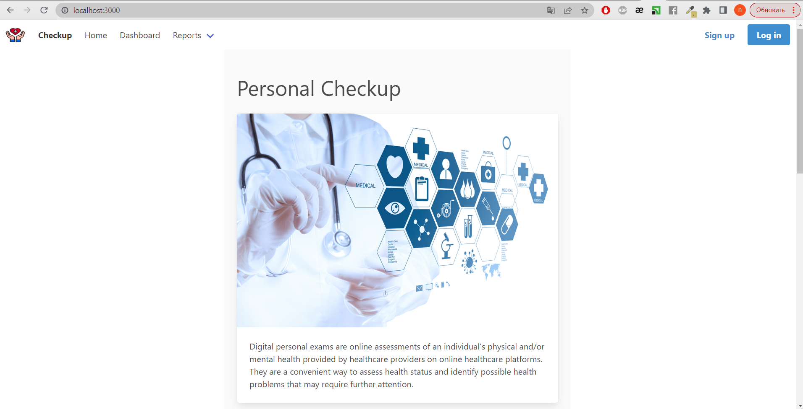
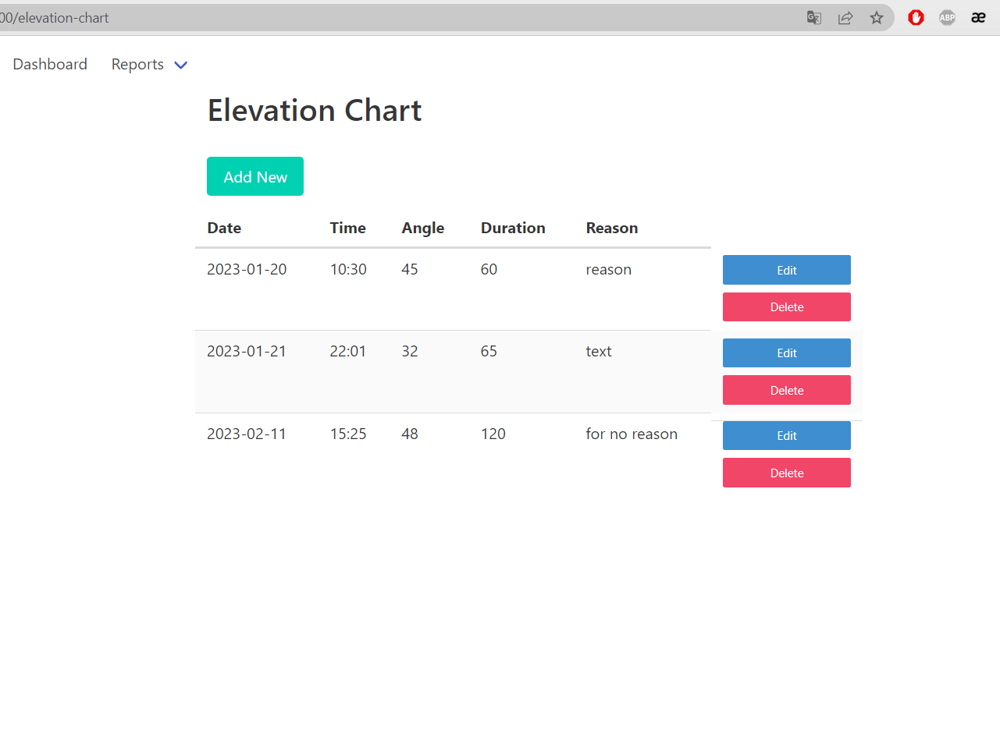
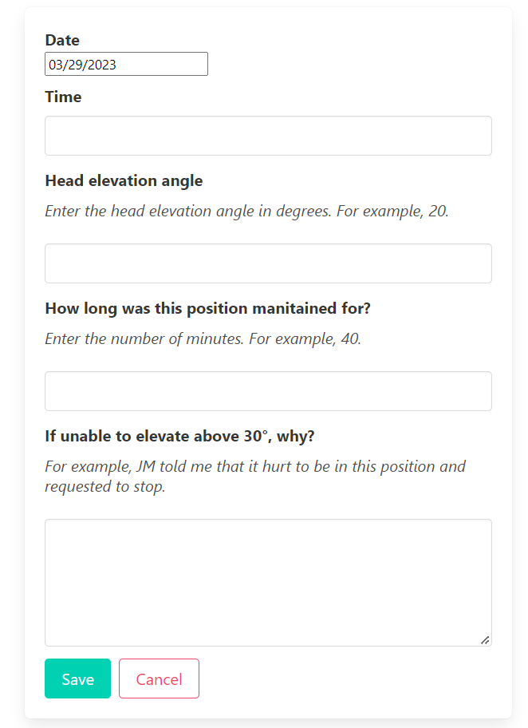
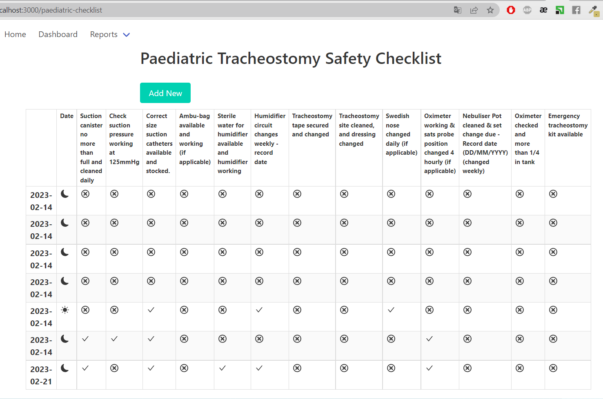
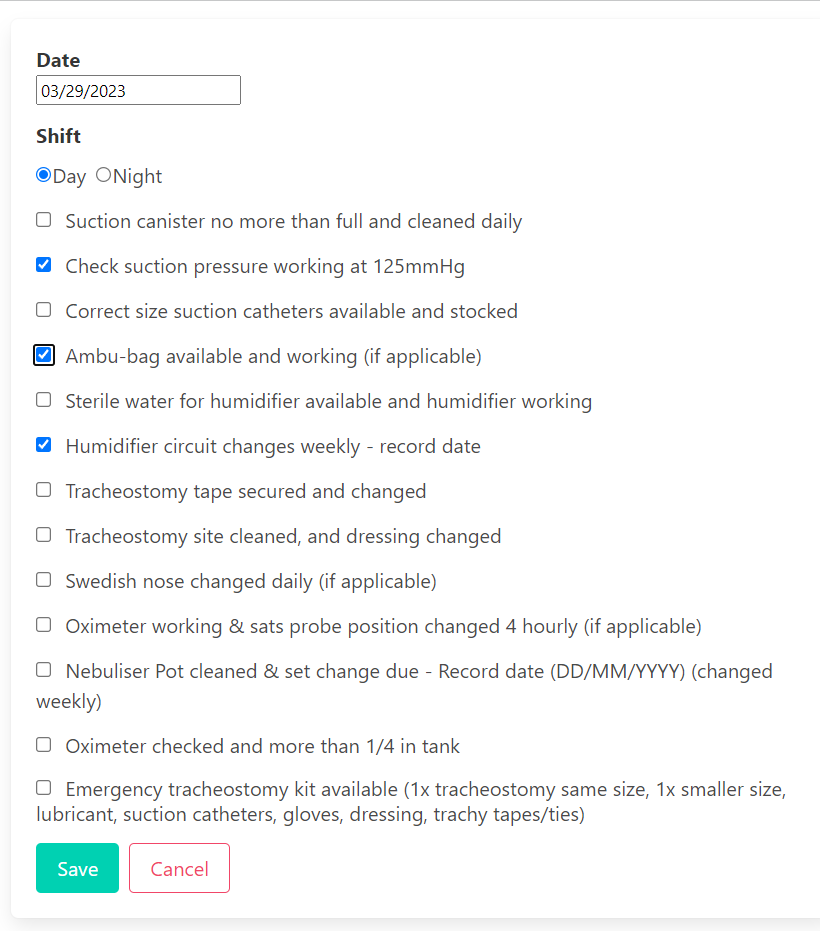
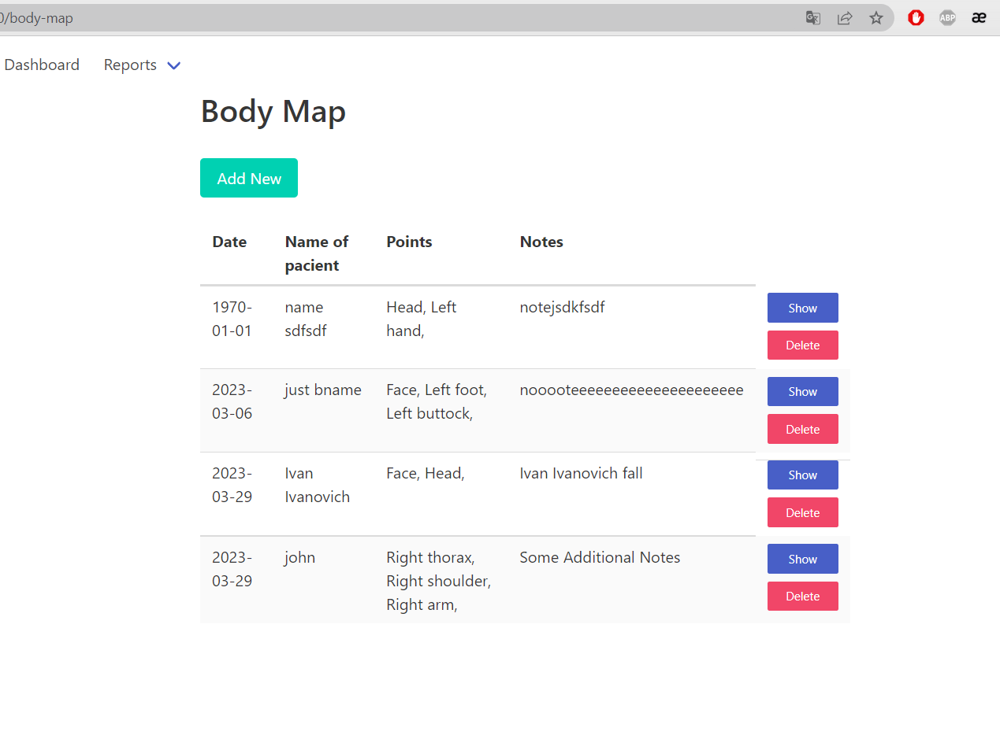
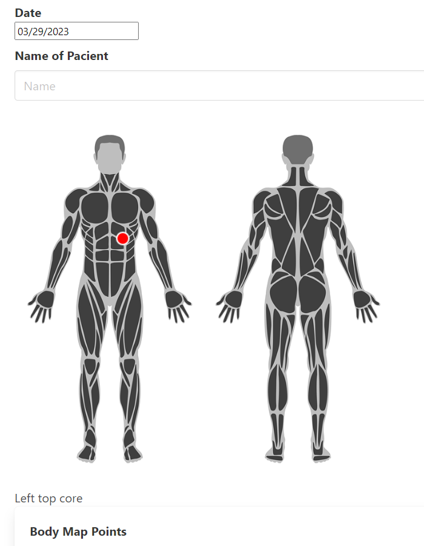

# Web application for digitizing medical records


### Prerequisites
* Node.js (version 16.16 and higher)
* NPM (version 9 and higher) or Yarn (version 1.2 and higher)
* Express.js (version 4.18 and higher)
* React.js (version 18.2 and higher)  

### For launch
```
npm install  
```
  or  
```  
yarn install
```


### Connecting the server to the database
Before starting the application, it is necessary to connect the server to the database using a special token. An example of such token, where instead of the **_username_** and **_password_** parts you should insert the data your database.   
_dbURI: ’mongodb+srv ://username : password @sandbox .jadwj.mongodb.net/ myFirstDatabase ? retryWrites =true&w=majority ’_  
The token needs to be inserted into a file called 'keys' in the s variable named 'mongodb' in the format:  

```
const Keys = {  
  mongodb: { "Token" }  
}  
```  

### Starting the web application
To run the application, you need to run commands in two terminals   
In the first terminal (to start the backend):  
```
npm run build
npm run dev
```
or  
```
yarn build
yarn run dev
```
In the second terminal (to start the frontend):  
```
npm run build
npm run start
```
or  
```
yarn build
yarn start
```
The application will be available at the local address **localhost:3000** (http://localhost:3000)

### Project structure
* The application code is divided into directories according to a certain structure.
* A directory named **'/frontend'** contains the files that make up part of the website, which the user sees and interacts with, i.e. the so-called frontend.
* The directory named **'/backend'** contains the files that make up part of the website, which is processed on the server, i.e. the so-called backend. 
* The directory named **'/src'** contains the very source code of the part of the website that the user sees and swith which it interacts, i.e. the front end. This directory is further divided into other directories to make the code better organized and clearer.
* The file called **'backend.js**' contains the code that forms the backend of the website
applications.


### Result  

**Screen Home**  
<br />
   
<br />
   
<br />  

**Text record**  
<br />
   
<br />
   
<br />  

**Record Checklist**  
<br />
   
<br />
   
<br />  

**Record Body Map**  
<br />
   
<br />
   
<br /> 


