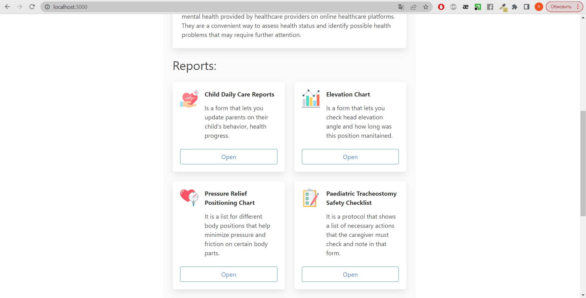

# Web application for digitizing medical records


### Prerequisites
* Node.js (version 16.16 and higher)
* NPM (version 9 and higher) or Yarn (version 1.2 and higher)
* Express.js (version 4.18 and higher)
* React.js (version 18.2 and higher)  
* MongoDB, mongoose

### For launch
```
npm install  
```
  or  
```  
yarn install
```


### Connecting the server to the database
Before starting the application, it is necessary to connect the server to the database using a special token. An example of such token, where instead of the **_username_** and **_password_** parts you should insert the data your database.   
_dbURI: ’mongodb+srv ://username : password @sandbox .jadwj.mongodb.net/ myFirstDatabase ? retryWrites =true&w=majority ’_  
The token needs to be inserted into a file called 'keys' in the s variable named 'mongodb' in the format:  

```
const Keys = {  
  mongodb: { "Token" }  
}  
```  

### Starting the web application
To run the application, you need to run commands in two terminals   
In the first terminal (to start the backend):  
```
npm run build
npm run dev
```
or  
```
yarn build
yarn run dev
```
In the second terminal (to start the frontend):  
```
npm run build
npm run start
```
or  
```
yarn build
yarn start
```
The application will be available at the local address **localhost:3000** (http://localhost:3000)

### Project structure
* The application code is divided into directories according to a certain structure.
* A directory named **'/frontend'** contains the files that make up part of the website, which the user sees and interacts with, i.e. the so-called frontend.
* The directory named **'/backend'** contains the files that make up part of the website, which is processed on the server, i.e. the so-called backend. 
* The directory named **'/src'** contains the very source code of the part of the website that the user sees and swith which it interacts, i.e. the front end. This directory is further divided into other directories to make the code better organized and clearer.
* The file called **'backend.js**' contains the code that forms the backend of the website
applications.


### Result  

**Screen Home**  
* Contains short information about the project and a navigation panel.  

   
<br />
   
<br />  

**Text records**    
* Functionality consists of adding a new medical record, editing or deleting it existing records and displaying all records in the form of a table.  
* The date and time of the recording are automatic filled in, but the user has the option to change them if necessary.  
* Input validation implemented.  

 
   
<br />   


**Record Checklist **    
* Chronological Checklist record.
* It is possible to add a new record and view all entries in the table.
* The date and time of the recording are automatic filled in, but the user has the option to change them if necessary.   

 
   
<br />  


**Record Body Map**  
* Interactive map for recording health status the patient. 
* Allows you to add a new record, delete record, show all records in a table, but unlike other forms, it contains visual information about the location of the problem on the patient's body.
* The character silhouette consists of a background image and interactive points that allow the user to mark the necessary areas (_react-img-mapper_ library).     

   
<br />
   
<br />   

**Screen Dashboard**  
* A pair of graphs that provide information about the vital functions of the patient's body.
* Charts were created using _MongoDB Atlas Charts_. Then the given graphs were imported into website using the _charts-embed-dom_ library as a _ChartsEmbedSDK_ component.
* Functionality includes adding new data to be instantly displayed on charts and automatically refreshing charts every hour.   

   
<br />   

**Mobile version**  
* The main purpose of this work was to create a web application that is optimized for use on a computer. Therefore, the functionality of the mobile version of the application limited to basic functions only. However, in the future it is possible to expand it by other functions.   

   
<br />  

**Registration and login** 
* Authentication and basic authorization were implemented in the application (the application can distinguish a logged-in user from a non-logged-in one).
* The _bcrypt_ library was used to protect the saved password, which allows encryption and decryption of the user password using a special generated key.
* Preview user stored in database with password encryption.   
```
_id: ObjectID ’6408cd743c030331aaa1b642’
name: ’admin’
email: ’admin’
password: ’2b106nIgxBIQxVVKykvhvHqs5u.d6IQEUdcL0KqWX5qoZPGZVlgGBdiI’
```

