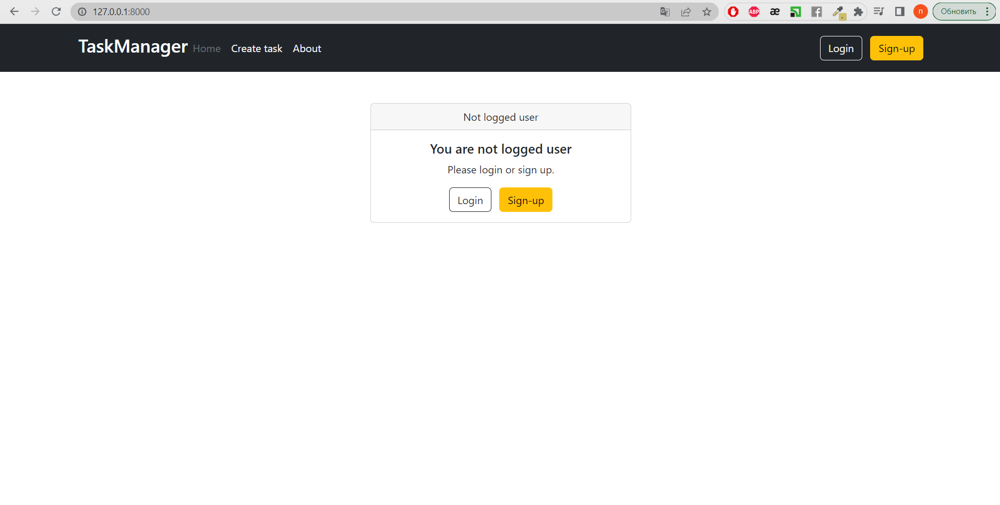
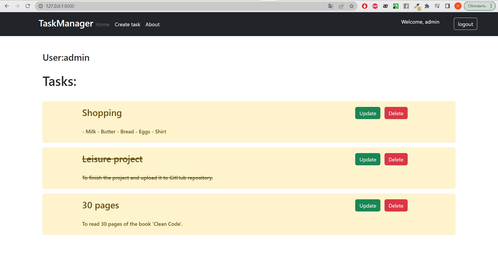
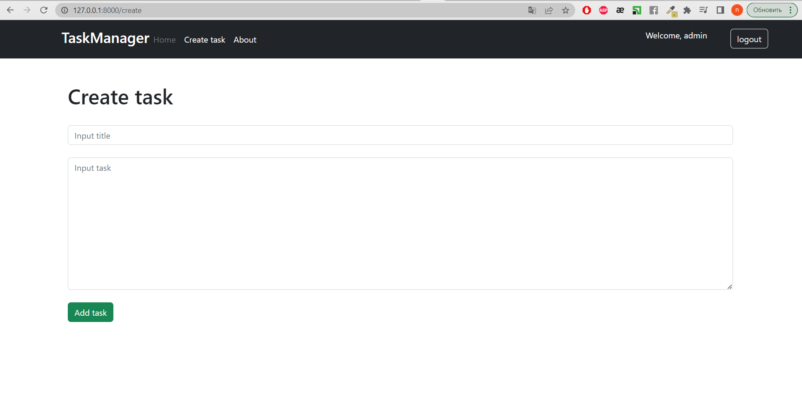
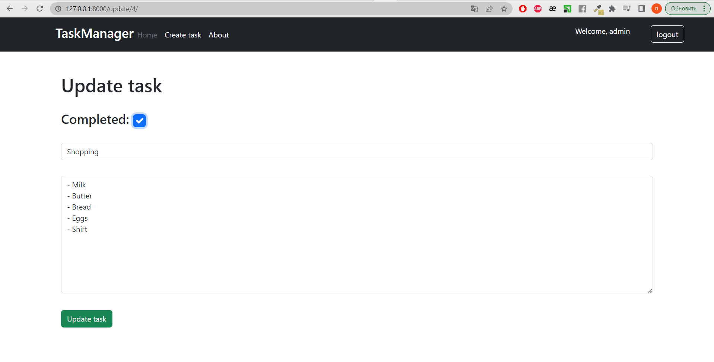
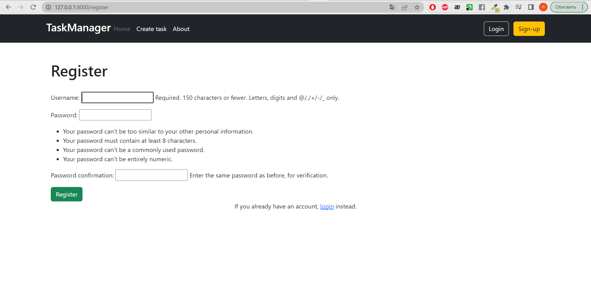
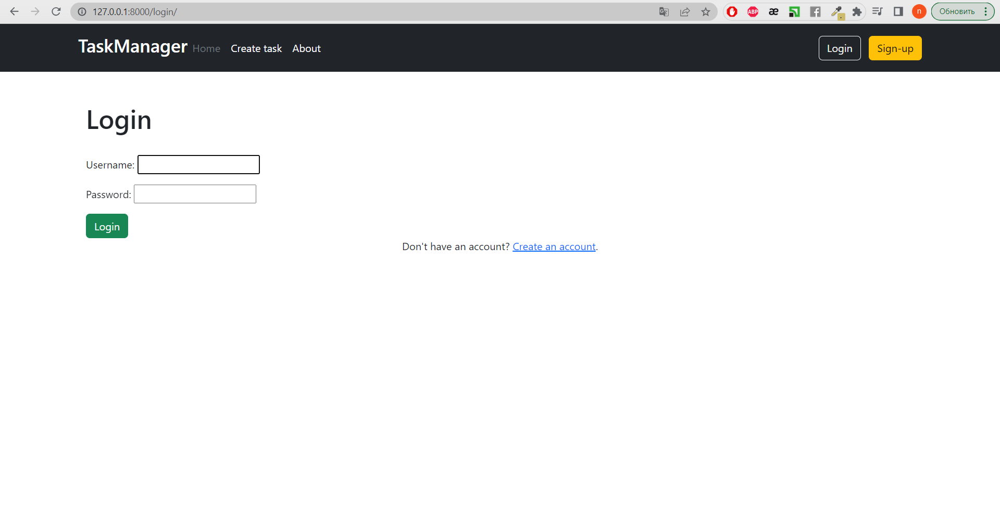

# Task Manager Web Application
The web application, Task Manager, was implemented using Django and Bootstrap. <br>  
**Functionalities:**   
* include adding tasks 
* editing tasks
* deleting tasks
* user registration 
* login

## Installation

1. Clone the repository:
```
git clone https://github.com/natali99n/my-projects/weatherApp.git
```
2 Apply database migrations:
```
python manage.py migrate
```
## Usage

1. Start the development server in the project directory:
```
python manage.py runserver
```

2. Open your web browser and access the application at `http://localhost:8000`.

3. Explore the weather information for different cities, add new cities, and delete cities as needed.

## Result  

**Home Screen**  
* Unauthenticated users see a window prompting them to log in or register  



* Authenticated users can view tasks, and they can also see the username of the logged-in user
* Tasks that have been marked as completed are displayed with a strikethrough font
* The functionality of displaying each user only their own tasks is currently under development :)  



**Create task form**  
* The form allows adding new tasks  



**Update task**  
* The form allows editing tasks and marking them as completed    



**Registration and Login**  





