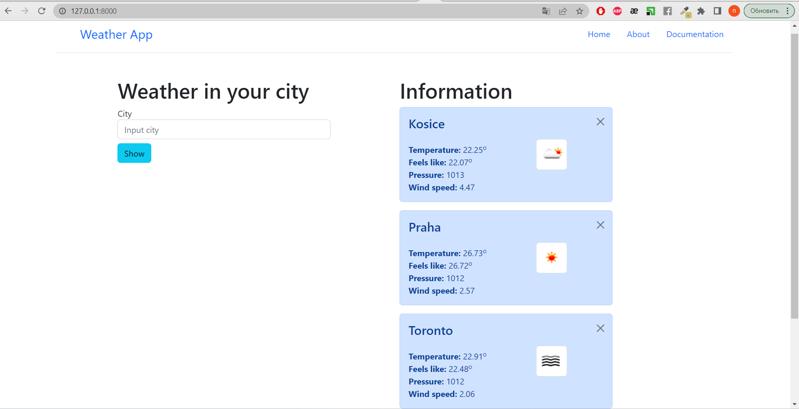

# Weather Web Application

This is a web application built on the Django framework with the use of Bootstrap. It provides weather information for different cities, allows adding new cities, and displays weather data for a selected city. Additionally, it allows deleting a city along with its weather data.

## Installation

1. Clone the repository:
```
git clone https://github.com/natali99n/my-projects/weatherApp.git
```
2 Apply database migrations:
```
python manage.py migrate
```
## Usage

1. Start the development server:
```
python manage.py runserver
```

2. Open your web browser and access the application at `http://localhost:8000`.

3. Explore the weather information for different cities, add new cities, and delete cities as needed.



